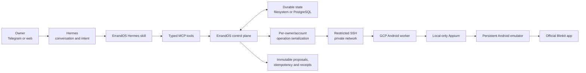

# JaldiAI

JaldiAI turns a spoken or written errand into a reviewable, transaction-safe
action. This repository contains two first-class ways to run it.


https://github.com/user-attachments/assets/bd348bae-bda7-484f-8857-7aa9803e283c


## Implementations

### Hosted

[`hosted/`](hosted/) is the Hermes-oriented hosted implementation. It contains
the web interface, control plane, workers, typed MCP tools, provider adapters,
durable transaction state, and remote Android-worker infrastructure.

See [the hosted overview](hosted/HOSTED.md) and
[hosted setup guide](hosted/README.md).

### Local

[`local/`](local/) is the phone-first implementation used for the buildathon
demo. It is now self-contained: it includes the complete hosted control plane,
worker, contracts, persistence, Hermes skill, and semantic Blinkit driver
alongside the circular push-to-talk overlay and Sarvam voice server. The
overlay stays a thin voice-and-status surface while the copied execution stack
owns recovery, exact offer selection, cart mutation, and verification.

See [the local overview](local/LOCAL.md), [product description](local/docs/PRODUCT.md),
and [build log](local/docs/BUILD_LOG.md).

## Safety boundary

- Searching and cart preparation may interact with the provider app.
- A broad product request asks the user to choose instead of silently selecting
  a top result.
- Preparation never silently places an order.
- Exact cart and checkout terms are reviewed before any final action.
- Final paid actions require explicit confirmation, idempotency, and verified
  provider evidence.
- An uncertain result is recorded as ambiguous and checked read-only instead
  of blindly retried.

## Setup

Each implementation is an independent pnpm workspace:

```bash
pnpm --dir local install
pnpm --dir local test

pnpm --dir hosted install
pnpm --dir hosted test
```

Copy the relevant template before running:

- Hosted: `hosted/.env.example` → `hosted/.env`
- Local voice server: `local/apps/voice/.env.example` →
  `local/apps/voice/.env.local`

Real env files are intentionally ignored and stay only on the development
machine. Only safe `.env.example` templates are committed.

## Use the local Android companion

This is the shortest path for running JaldiAI with the circular companion on a
real Android phone. The Mac runs the voice server and Appium; the Android app
records speech, shows progress and choices, and controls the already-installed
official Blinkit app through that local stack.

### 1. Install the prerequisites

You need:

- Node.js 22 or newer and pnpm 10 or newer.
- JDK 17 and the Android SDK platform tools (`adb`).
- Appium 3 with the UiAutomator2 driver.
- An Android phone with developer options and USB or wireless debugging
  enabled.
- Blinkit installed and already signed in on the phone.
- Server-side OpenAI and Sarvam API keys.

Install the JavaScript workspaces from the repository root:

```bash
pnpm --dir local install
```

Install Appium and its Android driver if they are not already available:

```bash
npm install --global appium
appium driver install uiautomator2
appium driver doctor uiautomator2
```

### 2. Connect the phone

For USB, connect the unlocked phone and accept its debugging prompt:

```bash
adb devices -l
```

For wireless debugging, the phone and Mac must be on the same Wi-Fi or hotspot.
Use the pairing address shown under **Developer options → Wireless debugging**:

```bash
adb pair PHONE_IP:PAIRING_PORT
adb connect PHONE_IP:DEBUG_PORT
adb devices -l
```

The pairing and debugging ports can be different. Copy the complete value from
the first column of `adb devices -l`, for example
`192.168.1.100:37121`. That exact value is the device ID used below.

### 3. Configure the voice server

Create the ignored local environment file once:

```bash
cp local/apps/voice/.env.example local/apps/voice/.env.local
chmod 600 local/apps/voice/.env.local
```

Edit `local/apps/voice/.env.local` and provide at least:

```dotenv
OPENAI_API_KEY=your-server-managed-openai-key
SARVAM_API_KEY=your-server-managed-sarvam-key
APPIUM_URL=http://127.0.0.1:4723
ANDROID_DEVICE_UDID=192.168.1.100:37121

# Keep final order placement disabled during ordinary cart testing.
ERRANDOS_LIVE_COMMIT=false

# Safe defaults for the optional control/vision rollout.
JALDI_LOG_CONTENT_V1=false
JALDI_SCREENSHOT_OBSERVATION_V1=false
JALDI_VISION_GROUNDING_V1=false
JALDI_REALTIME_SHADOW_V1=false
JALDI_REALTIME_CONTROL_V1=false
JALDI_REALTIME_PHONE_TOOLS_V1=false
```

Replace the example device ID with the exact USB or wireless value reported by
ADB. Do not put API keys in the Android application and do not commit
`.env.local`.

Workflow V2 and authoritative task state are release invariants and are already
enabled; there is no legacy workflow flag to turn on. Task and operation state
is stored under `local/apps/voice/.runtime/` by default.

Sarvam remains responsible for speech-to-text and text-to-speech. To
experiment with GPT Realtime as the bounded control/reasoning transport—not as
the speech provider—enable:

```dotenv
JALDI_REALTIME_CONTROL_V1=true
JALDI_REALTIME_PHONE_TOOLS_V1=true
```

Leave those options off for the baseline demo until the Realtime rollout
canary has been completed.

### 4. Start Appium

Keep this running in its own terminal:

```bash
appium --address 127.0.0.1 --port 4723
```

Confirm it is ready:

```bash
curl http://127.0.0.1:4723/status
```

The returned JSON should contain `ready: true`.

### 5. Build and install the companion

From the repository root:

```bash
./local/apps/android-overlay/build.sh
adb -s 'YOUR_EXACT_DEVICE_ID' install -r \
  local/apps/android-overlay/dist/errandos-overlay-debug.apk
adb -s 'YOUR_EXACT_DEVICE_ID' reverse tcp:3100 tcp:3100
adb -s 'YOUR_EXACT_DEVICE_ID' shell am start \
  -n ai.errandos.overlay/.MainActivity
```

On the phone, allow microphone access, notifications, and **Display over
other apps** when Android asks. Keep the phone unlocked while running Appium
automation.

The reverse mapping makes the phone's `127.0.0.1:3100` reach the Mac's local
voice server. It works for either the selected USB or wireless ADB transport.

### 6. Start the voice server

For development, run this from `local/` and keep the terminal visible for live
logs:

```bash
PORT=3100 pnpm --filter @errandos/voice dev
```

Open [http://127.0.0.1:3100](http://127.0.0.1:3100) on the Mac to confirm that
the server is responding.

For a frozen production-style demo:

```bash
cd local
pnpm --filter @errandos/voice build
pnpm --filter @errandos/voice start -- --port 3100
```

Restart the server after changing `.env.local`. This avoids using stale API
keys, device IDs, or rollout settings inherited by an older process.

### 7. Give JaldiAI a task

1. Open Blinkit and leave the phone unlocked.
2. Press and hold the JaldiAI companion.
3. Speak while it shows **Listening**.
4. Release to submit the request.
5. If a product-choice card appears, tap a row or answer by voice. Both paths
   resolve the same retained interaction.
6. JaldiAI searches, adds, verifies, announces the completed item, and
   automatically advances to the next item.
7. After the final verified item, it shows a `NOT ORDERED` cart summary.

Example requests:

```text
Add Amul milk and Amul vanilla ice cream to my cart.
Add potato, paneer, chicken, and a 10 kg bag of rice.
Show me what is currently in my cart.
```

An ambiguous mutation stops the dependent queue and offers only safe recovery,
such as checking the cart again. It never blindly adds the next item when the
previous mutation outcome is unknown.

### 8. Checkout and COD safety

Cart preparation and final order placement are different operations.

- With `ERRANDOS_LIVE_COMMIT=false`, JaldiAI may build and review the cart but
  cannot perform the final order action.
- Set `ERRANDOS_LIVE_COMMIT=true` only when the owner intentionally wants to
  test ordering.
- Review the exact items, quantities, prices, fees, address, payment mode, and
  provider fingerprint before confirming.
- COD is still a paid external action. JaldiAI attempts the final provider
  action at most once.
- If the final result cannot be verified, it becomes `ambiguous` and requires
  read-only reconciliation; do not repeat the order command.

### Troubleshooting

**Holding the companion produces no server log**

```bash
adb -s 'YOUR_EXACT_DEVICE_ID' reverse --list
curl http://127.0.0.1:3100
```

The reverse list must include `tcp:3100 tcp:3100`. Recreate the mapping after
reconnecting ADB or restarting the phone.

**The phone shows “Understanding” and later times out**

```bash
adb devices -l
curl http://127.0.0.1:4723/status
```

Verify that the exact `ANDROID_DEVICE_UDID` is still in the `device` state,
Appium reports ready, the phone is unlocked, and Blinkit is signed in. Restart
the voice server if `.env.local` changed.

**Wireless ADB disconnected**

Run `adb connect PHONE_IP:DEBUG_PORT` again, confirm the exact serial with
`adb devices -l`, and recreate the port-3100 reverse mapping for that serial.

**The product card is visible but nothing is added**

Choose one exact option by tapping its row or speaking its title/size. If the
operation becomes ambiguous, use **Check cart again** rather than issuing a
second add command.

### Verify before a demo

```bash
pnpm --dir local typecheck
pnpm --dir local dead-code:check
pnpm --dir local --filter @errandos/voice test
pnpm --dir local --filter @errandos/provider-connectors test
./local/apps/android-overlay/build.sh
```

The detailed production-mode profile and read-only connectivity checks are in
[the local demo guide](local/docs/2026-07-28-local-production-demo-profile.md).

---

## Mirrored hosted implementation guide

> The section below mirrors [`hosted/README.md`](hosted/README.md). Relative
> documentation links have been adjusted for the repository-root location.


[Live web interface](https://chores-ai.vercel.app/)

ErrandOS is a Hermes-first personal operations control plane for real-world errands in India. Its current production slice lets one owner use natural language to search Blinkit, manage a real cart, review exact COD terms, place an explicitly requested order at most once, reconcile uncertain outcomes, and share the official cart link.

Hermes owns the conversation and reasoning. ErrandOS owns provider access, durable state, transaction safety, and the final external action.

### Current status

The Blinkit Android workflow is implemented and live verified through the normal production path:

```text
Telegram / web
    → Hermes
    → typed ErrandOS MCP tools
    → owner VPC
    → private SSH/Tailscale connection
    → GCP Android worker
    → local-only Appium
    → persistent Android emulator
    → official Blinkit app
```

The current deployment supports:

- Persistent Blinkit authentication with phone number and OTP.
- Sanitized dependency readiness and current-screen diagnosis.
- Live catalog search with opaque offer IDs.
- Exact cart inspection, addition, quantity changes, removal, and clearing.
- Saved-address labels and sanitized recent-order history.
- Durable asynchronous cart preparation.
- Structured provider constraints such as unavailable COD, minimum subtotal, price changes, and unserviceable addresses.
- Immutable COD proposals containing exact items, prices, fees, address label, ETA, expiry, and provider fingerprint.
- Owner-authorized COD placement with idempotency and an at-most-once final action.
- Read-only reconciliation after ambiguous provider outcomes.
- Native Blinkit cart sharing with a verified official Blinkit URL.
- An owner-only Telegram `/screen` diagnostic for safe catalog surfaces.
- Optional Sarvam-powered multilingual voice input and output.

The canonical implementation roadmap and live evidence are maintained in [docs/blinkit-implementation-roadmap.md](hosted/docs/blinkit-implementation-roadmap.md).

### Architecture



#### Hermes responsibilities

- Understand natural-language intent.
- Ask for missing product, quantity, address, or approval information.
- Select narrow ErrandOS tools.
- Render structured results as readable messages or cards.
- Poll durable operations and continue the conversation.

#### ErrandOS responsibilities

- Custody of provider account and emulator state.
- Principal-isolated provider operations.
- Exact provider-state extraction and cart verification.
- Immutable proposal snapshots and SHA-256 hashes.
- Approval and explicit-ordering checks.
- Idempotency and duplicate-action prevention.
- At-most-once final provider dispatch.
- Receipts, lifecycle state, audit records, and read-only reconciliation.

### Blinkit transaction flow

```text
Owner request
    ↓
Read readiness and authentication
    ↓
Search products or inspect the existing cart
    ↓
Edit/build the cart through typed operations
    ↓
Prepare an immutable COD proposal
    ↓
Hermes renders the exact terms and proposal hash
    ↓
Owner explicitly asks to place those terms
    ↓
ErrandOS revalidates the provider fingerprint and idempotency key
    ↓
One final provider action is attempted at most once
    ↓
Verified receipt, blocked result, or ambiguous reconciliation state
```

Preparation never places an order. If a final action times out or cannot be verified, ErrandOS records an `ambiguous` result and reconciles using read-only provider history. It never blindly repeats the final action.

### Canonical Hermes tools

Production advertises 36 focused provider MCP tools: 24 for Blinkit and 12 for Rapido.

#### Readiness and authentication

- `blinkit_readiness`
- `blinkit_current_screen`
- `blinkit_auth_status`
- `blinkit_begin_login`
- `blinkit_submit_otp`
- `rapido_auth_status`
- `rapido_begin_login`
- `rapido_submit_otp`
- `rapido_resend_otp`
- `rapido_readiness`

#### Rapido ride lifecycle

- `rapido_quote_rides`
- `rapido_prepare_ride`
- `rapido_compare_proposal`
- `rapido_request_ride`
- `rapido_ride_status`
- `rapido_reconcile_ride`
- `rapido_recent_trips`

#### Discovery and account reads

- `blinkit_search_products`
- `blinkit_list_saved_addresses`
- `blinkit_select_saved_address`
- `blinkit_recent_orders`

#### Cart operations

- `blinkit_cart_status`
- `blinkit_add_cart_item`
- `blinkit_set_cart_item_quantity`
- `blinkit_remove_cart_item`
- `blinkit_clear_cart`
- `blinkit_share_cart`

#### Preparation and order lifecycle

- `blinkit_start_prepare_cod_order`
- `blinkit_operation_status`
- `blinkit_recent_operations`
- `blinkit_prepare_existing_cart_cod_order`
- `blinkit_compare_proposal`
- `blinkit_place_cod_order`
- `blinkit_order_status`
- `blinkit_reconcile_order`

Legacy generic transaction handlers remain available only when `ERRANDOS_MCP_LEGACY_TOOLS=true`. Rapido ride tools are implemented through the official Android app; live route/fare calibration remains a prepare-only canary prerequisite, and the final ride-request gate stays off by default.

### Safety and transaction invariants

ErrandOS treats paid external actions as transactions rather than chat replies.

1. Search and status reads are safe.
2. Cart editing and grocery/ride preparation may operate the official app but must stop before the final order or ride-request action.
3. COD and ride requests are paid external actions.
4. Every commit requires a stable idempotency key.
5. The final provider action may be attempted at most once.
6. Items, quantities, prices, fees, address, payment mode, ETA, expiry, and provider fingerprint are bound to the immutable proposal.
7. Materially changed terms require a new proposal.
8. An unverified final result becomes `ambiguous` and enters read-only reconciliation.
9. OTPs are accepted only through typed login tools and are never echoed, persisted, traced, or returned.
10. MCP never exposes Appium, ADB, selectors, coordinates, UI XML, cookies, session paths, or arbitrary device commands. Screenshots remain internal except for the separately gated personal owner-only post-order evidence flow described below.
11. Success is reported only when a verified provider reference or committed receipt exists.

Two independent kill switches protect live execution:

```text
ERRANDOS_LIVE_BROWSER_ACTIONS=true  # enables reversible Android provider actions
ERRANDOS_LIVE_COMMIT=true           # separately enables the final order action
```

The first variable keeps its legacy name but does not activate Playwright. Blinkit is Android-only.

For one trusted owner on a private VPC, COD can use owner-autonomous mode:

```text
ERRANDOS_DEPLOYMENT_PROFILE=personal
ERRANDOS_TRUSTED_AUTONOMOUS_COD=true
```

This removes the external approval-capability step only for Blinkit COD. Proposal hashing, exact-term revalidation, idempotency, at-most-once dispatch, receipts, and reconciliation remain mandatory.

For a single trusted owner who explicitly wants visual proof after a verified order, enable:

```text
ERRANDOS_OWNER_ORDER_EVIDENCE=true
```

This is valid only with `ERRANDOS_DEPLOYMENT_PROFILE=personal`. After a durable `committed` result with a verified provider reference, a separate restricted media helper may send the raw Blinkit confirmation, tracking, or delivered screen to the configured owner's private Telegram DM. It is not an MCP screenshot tool. It must refuse login, OTP, password, payment-credential, bank-challenge, group, and unverified-order contexts; use a short-lived owner-only file; and delete the file after delivery.

### Repository layout

```text
errandos/
├── apps/
│   ├── control-plane/       # MCP server and transaction runtime
│   ├── web/                 # Next.js owner interface
│   └── worker/              # fixed Android worker entry point
├── packages/
│   ├── application/         # proposals, operations, authorization, commits
│   ├── contracts/           # Zod MCP and worker boundaries
│   ├── domain/              # shared domain primitives
│   ├── location/            # location primitives
│   ├── observability/       # health and observability primitives
│   ├── persistence/         # PostgreSQL repositories and migrations
│   ├── product-search/      # read-only product-search integration
│   └── provider-connectors/ # AndroidBlinkitAdapter, Appium driver, SSH worker client
├── hermes/
│   └── skills/errandos/     # Hermes decision tree and rendering guidance
├── infra/
│   ├── gcp/android-worker/  # emulator, Appium, provisioning and deployment
│   └── hermes/              # owner-only Telegram screen command installer
├── scripts/
│   ├── run-mcp-secure.sh
│   └── capture-blinkit-screen.sh
├── docs/
├── pnpm-workspace.yaml
└── package.json
```

### Local development

#### Requirements

- Node.js 22 or newer.
- pnpm 10 or newer.
- PostgreSQL for persistence and transaction-durability tests.

#### Install and verify

```bash
pnpm install
pnpm typecheck
pnpm lint
pnpm test
pnpm build
```

PostgreSQL-backed tests must run against an actual test database. Do not treat a run that skipped database integration as full durability verification.

#### Run locally

Control plane:

```bash
pnpm --filter @errandos/control-plane dev
```

Web app:

```bash
pnpm --filter @errandos/web dev
```

Start configuration from [.env.example](hosted/.env.example). Keep real secrets and provider state outside the repository.

### Important configuration

| Variable | Purpose |
| --- | --- |
| `ERRANDOS_DEPLOYMENT_PROFILE` | Selects the `personal` single-owner profile. |
| `ERRANDOS_PERSISTENCE_MODE` | Uses durable `filesystem` state for one encrypted personal VPC or `postgres` for shared deployments. |
| `DATABASE_URL` | PostgreSQL connection string when PostgreSQL persistence is selected. |
| `ERRANDOS_DATA_ROOT` | Durable state root outside git. |
| `ERRANDOS_PROFILE_REF_SECRET` | Creates opaque principal-scoped provider references. |
| `ERRANDOS_APPROVAL_HMAC_SECRET` | Signs and consumes single-use authorization capabilities. |
| `ERRANDOS_TRUSTED_AUTONOMOUS_COD` | Enables personal owner-autonomous Blinkit COD. |
| `ERRANDOS_LIVE_BROWSER_ACTIONS` | Reversible Android provider-action gate. |
| `ERRANDOS_LIVE_COMMIT` | Independent final-order kill switch. |
| `ERRANDOS_BLINKIT_EXECUTION` | Must be `android`. |
| `ERRANDOS_RAPIDO_EXECUTION` | Must be `android` when Rapido tooling is enabled. |
| `ERRANDOS_RAPIDO_LIVE_COMMIT` | Additional Rapido-only final ride-request gate; defaults false. |
| `ERRANDOS_ANDROID_WORKER_SSH_HOST` | Private hostname of the Android worker. |
| `ERRANDOS_ANDROID_WORKER_IDENTITY_FILE` | Restricted worker SSH identity. |
| `ERRANDOS_ANDROID_WORKER_KNOWN_HOSTS_FILE` | Pinned worker host keys. |
| `ERRANDOS_ANDROID_WORKER_COMMAND` | Fixed forced-command worker entry point. |

The GCP worker keeps Appium and ADB bound locally. Deployment and safe-screen details are documented in [infra/gcp/android-worker/README.md](hosted/infra/gcp/android-worker/README.md).

### Hermes integration

The production MCP entry point is [scripts/run-mcp-secure.sh](hosted/scripts/run-mcp-secure.sh). The bundled skill at [hermes/skills/errandos/SKILL.md](hosted/hermes/skills/errandos/SKILL.md) teaches Hermes when to inspect, search, edit, prepare, share, place, poll, and reconcile.

Example owner requests:

```text
Search Blinkit for Diet Coke.
Add two Lay's Magic Masala packs to my cart.
What is currently in my Blinkit cart?
Prepare this cart for COD at Home.
Share my current Blinkit cart and send the official link.
Place the exact prepared COD order.
```

The cart-sharing request returns the official Blinkit URL but does not prepare or place an order.

#### Direct-use public cart handoff

For a buildathon or limited public beta, run a separate cart-only Hermes/MCP
profile using [hermes/mcp.public-cart.example.yaml](hosted/hermes/mcp.public-cart.example.yaml)
and set `ERRANDOS_PUBLIC_CART_HANDOFF=true` on the web process. The public MCP
surface advertises only Blinkit readiness, search, clear, add, sanitized screen
recovery, and native share tools. Login, saved addresses, order history,
checkout preparation, reconciliation, and every final action are absent.

The mobile web flow serializes each agent turn, validates the returned URL
against the Blinkit HTTPS domain, and renders an **Open in Blinkit** handoff.
The visitor completes location, price, delivery, payment, and checkout review
inside their own official Blinkit app. This mode must run as one web process
until a durable distributed queue replaces the in-process serializer.

Do not expose an owner's personal provider account to untrusted visitors. Use
it only for a supervised commit-disabled demo; an open deployment needs a
dedicated public Android worker and cart-building account, ingress rate
limiting, and provider policy review.

### Multilingual voice interface

The web app can use Sarvam for Indic speech recognition, fact-preserving translation, and speech generation while Hermes remains the conversation and tool-orchestration layer. See [docs/sarvam-hermes-voice.md](hosted/docs/sarvam-hermes-voice.md) for setup, architecture, safety boundaries, and the demo checklist.

Server-side voice variables include:

```text
SARVAM_API_KEY
SARVAM_API_BASE_URL
HERMES_API_URL
HERMES_API_KEY
HERMES_MODEL
```

Never expose these values through browser bundles.

### Provider policy

Blinkit runs only through the provider-specific `AndroidBlinkitAdapter`, which operates the official app in a principal-isolated persistent emulator. Playwright is not an active Blinkit runtime.

ErrandOS does not:

- Reverse-engineer private provider APIs.
- Intercept provider traffic.
- Bypass device-integrity controls.
- Misrepresent the emulator.
- Expose generic click, JavaScript, Appium, ADB, or raw checkout tools.
- Multi-order providers and cancel losers.
- Fake successful orders or receipts.

### Further documentation

- [Blinkit implementation roadmap](hosted/docs/blinkit-implementation-roadmap.md)
- [Transaction architecture](hosted/docs/transaction-architecture.md)
- [Provider adapter scope](hosted/docs/provider-adapter-scope.md)
- [Agent-driven login](hosted/docs/agent-driven-login.md)
- [Sarvam and Hermes voice architecture](hosted/docs/sarvam-hermes-voice.md)
- [GCP Android worker](hosted/infra/gcp/android-worker/README.md)
