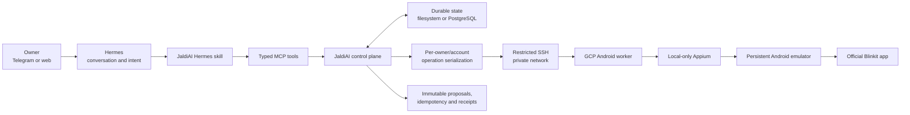

# JaldiAI

[Live web interface](https://chores-ai.vercel.app/)

JaldiAI is a Hermes-first personal operations control plane for real-world errands in India. Its current production slice lets one owner use natural language to search Blinkit, manage a real cart, review exact COD terms, place an explicitly requested order at most once, reconcile uncertain outcomes, and share the official cart link.

Hermes owns the conversation and reasoning. JaldiAI owns provider access, durable state, transaction safety, and the final external action.

## Current status

The Blinkit Android workflow is implemented and live verified through the normal production path:

```text
Telegram / web
    → Hermes
    → typed JaldiAI MCP tools
    → owner VPC
    → private SSH/Tailscale connection
    → GCP Android worker
    → local-only Appium
    → persistent Android emulator
    → official Blinkit app
```

The current deployment supports:

- Persistent Blinkit authentication with phone number and OTP.
- Sanitized dependency readiness and current-screen diagnosis.
- Live catalog search with opaque offer IDs.
- Exact cart inspection, addition, quantity changes, removal, and clearing.
- Saved-address labels and sanitized recent-order history.
- Durable asynchronous cart preparation.
- Structured provider constraints such as unavailable COD, minimum subtotal, price changes, and unserviceable addresses.
- Immutable COD proposals containing exact items, prices, fees, address label, ETA, expiry, and provider fingerprint.
- Owner-authorized COD placement with idempotency and an at-most-once final action.
- Read-only reconciliation after ambiguous provider outcomes.
- Native Blinkit cart sharing with a verified official Blinkit URL.
- An owner-only Telegram `/screen` diagnostic for safe catalog surfaces.
- Optional Sarvam-powered multilingual voice input and output.

The canonical implementation roadmap and live evidence are maintained in [docs/blinkit-implementation-roadmap.md](docs/blinkit-implementation-roadmap.md).

## Architecture



### Hermes responsibilities

- Understand natural-language intent.
- Ask for missing product, quantity, address, or approval information.
- Select narrow JaldiAI tools.
- Render structured results as readable messages or cards.
- Poll durable operations and continue the conversation.

### JaldiAI responsibilities

- Custody of provider account and emulator state.
- Principal-isolated provider operations.
- Exact provider-state extraction and cart verification.
- Immutable proposal snapshots and SHA-256 hashes.
- Approval and explicit-ordering checks.
- Idempotency and duplicate-action prevention.
- At-most-once final provider dispatch.
- Receipts, lifecycle state, audit records, and read-only reconciliation.

## Blinkit transaction flow

```text
Owner request
    ↓
Read readiness and authentication
    ↓
Search products or inspect the existing cart
    ↓
Edit/build the cart through typed operations
    ↓
Prepare an immutable COD proposal
    ↓
Hermes renders the exact terms and proposal hash
    ↓
Owner explicitly asks to place those terms
    ↓
JaldiAI revalidates the provider fingerprint and idempotency key
    ↓
One final provider action is attempted at most once
    ↓
Verified receipt, blocked result, or ambiguous reconciliation state
```

Preparation never places an order. If a final action times out or cannot be verified, JaldiAI records an `ambiguous` result and reconciles using read-only provider history. It never blindly repeats the final action.

## Canonical Hermes tools

Production advertises 36 focused provider MCP tools: 24 for Blinkit and 12 for Rapido.

### Readiness and authentication

- `blinkit_readiness`
- `blinkit_current_screen`
- `blinkit_auth_status`
- `blinkit_begin_login`
- `blinkit_submit_otp`
- `rapido_auth_status`
- `rapido_begin_login`
- `rapido_submit_otp`
- `rapido_resend_otp`
- `rapido_readiness`

### Rapido ride lifecycle

- `rapido_quote_rides`
- `rapido_prepare_ride`
- `rapido_compare_proposal`
- `rapido_request_ride`
- `rapido_ride_status`
- `rapido_reconcile_ride`
- `rapido_recent_trips`

### Discovery and account reads

- `blinkit_search_products`
- `blinkit_list_saved_addresses`
- `blinkit_select_saved_address`
- `blinkit_recent_orders`

### Cart operations

- `blinkit_cart_status`
- `blinkit_add_cart_item`
- `blinkit_set_cart_item_quantity`
- `blinkit_remove_cart_item`
- `blinkit_clear_cart`
- `blinkit_share_cart`

### Preparation and order lifecycle

- `blinkit_start_prepare_cod_order`
- `blinkit_operation_status`
- `blinkit_recent_operations`
- `blinkit_prepare_existing_cart_cod_order`
- `blinkit_compare_proposal`
- `blinkit_place_cod_order`
- `blinkit_order_status`
- `blinkit_reconcile_order`

Legacy generic transaction handlers remain available only when `ERRANDOS_MCP_LEGACY_TOOLS=true`. Rapido ride tools are implemented through the official Android app; live route/fare calibration remains a prepare-only canary prerequisite, and the final ride-request gate stays off by default.

## Safety and transaction invariants

JaldiAI treats paid external actions as transactions rather than chat replies.

1. Search and status reads are safe.
2. Cart editing and grocery/ride preparation may operate the official app but must stop before the final order or ride-request action.
3. COD and ride requests are paid external actions.
4. Every commit requires a stable idempotency key.
5. The final provider action may be attempted at most once.
6. Items, quantities, prices, fees, address, payment mode, ETA, expiry, and provider fingerprint are bound to the immutable proposal.
7. Materially changed terms require a new proposal.
8. An unverified final result becomes `ambiguous` and enters read-only reconciliation.
9. OTPs are accepted only through typed login tools and are never echoed, persisted, traced, or returned.
10. MCP never exposes Appium, ADB, selectors, coordinates, UI XML, screenshots, cookies, session paths, or arbitrary device commands.
11. Success is reported only when a verified provider reference or committed receipt exists.

Two independent kill switches protect live execution:

```text
ERRANDOS_LIVE_BROWSER_ACTIONS=true  # enables reversible Android provider actions
ERRANDOS_LIVE_COMMIT=true           # separately enables the final order action
```

The first variable keeps its legacy name but does not activate Playwright. Blinkit is Android-only.

For one trusted owner on a private VPC, COD can use owner-autonomous mode:

```text
ERRANDOS_DEPLOYMENT_PROFILE=personal
ERRANDOS_TRUSTED_AUTONOMOUS_COD=true
```

This removes the external approval-capability step only for Blinkit COD. Proposal hashing, exact-term revalidation, idempotency, at-most-once dispatch, receipts, and reconciliation remain mandatory.

## Repository layout

```text
errandos/
├── apps/
│   ├── control-plane/       # MCP server and transaction runtime
│   ├── web/                 # Next.js owner interface
│   └── worker/              # fixed Android worker entry point
├── packages/
│   ├── application/         # proposals, operations, authorization, commits
│   ├── contracts/           # Zod MCP and worker boundaries
│   ├── domain/              # shared domain primitives
│   ├── location/            # location primitives
│   ├── observability/       # health and observability primitives
│   ├── persistence/         # PostgreSQL repositories and migrations
│   ├── product-search/      # read-only product-search integration
│   └── provider-connectors/ # AndroidBlinkitAdapter, Appium driver, SSH worker client
├── hermes/
│   └── skills/errandos/     # Hermes decision tree and rendering guidance
├── infra/
│   ├── gcp/android-worker/  # emulator, Appium, provisioning and deployment
│   └── hermes/              # owner-only Telegram screen command installer
├── scripts/
│   ├── run-mcp-secure.sh
│   └── capture-blinkit-screen.sh
├── docs/
├── pnpm-workspace.yaml
└── package.json
```

## Local development

### Requirements

- Node.js 22 or newer.
- pnpm 10 or newer.
- PostgreSQL for persistence and transaction-durability tests.

### Install and verify

```bash
pnpm install
pnpm typecheck
pnpm lint
pnpm test
pnpm build
```

PostgreSQL-backed tests must run against an actual test database. Do not treat a run that skipped database integration as full durability verification.

### Run locally

Control plane:

```bash
pnpm --filter @errandos/control-plane dev
```

Web app:

```bash
pnpm --filter @errandos/web dev
```

Start configuration from [.env.example](.env.example). Keep real secrets and provider state outside the repository.

## Important configuration

| Variable | Purpose |
| --- | --- |
| `ERRANDOS_DEPLOYMENT_PROFILE` | Selects the `personal` single-owner profile. |
| `ERRANDOS_PERSISTENCE_MODE` | Uses durable `filesystem` state for one encrypted personal VPC or `postgres` for shared deployments. |
| `DATABASE_URL` | PostgreSQL connection string when PostgreSQL persistence is selected. |
| `ERRANDOS_DATA_ROOT` | Durable state root outside git. |
| `ERRANDOS_PROFILE_REF_SECRET` | Creates opaque principal-scoped provider references. |
| `ERRANDOS_APPROVAL_HMAC_SECRET` | Signs and consumes single-use authorization capabilities. |
| `ERRANDOS_TRUSTED_AUTONOMOUS_COD` | Enables personal owner-autonomous Blinkit COD. |
| `ERRANDOS_LIVE_BROWSER_ACTIONS` | Reversible Android provider-action gate. |
| `ERRANDOS_LIVE_COMMIT` | Independent final-order kill switch. |
| `ERRANDOS_BLINKIT_EXECUTION` | Must be `android`. |
| `ERRANDOS_RAPIDO_EXECUTION` | Must be `android` when Rapido tooling is enabled. |
| `ERRANDOS_RAPIDO_LIVE_COMMIT` | Additional Rapido-only final ride-request gate; defaults false. |
| `ERRANDOS_ANDROID_WORKER_SSH_HOST` | Private hostname of the Android worker. |
| `ERRANDOS_ANDROID_WORKER_IDENTITY_FILE` | Restricted worker SSH identity. |
| `ERRANDOS_ANDROID_WORKER_KNOWN_HOSTS_FILE` | Pinned worker host keys. |
| `ERRANDOS_ANDROID_WORKER_COMMAND` | Fixed forced-command worker entry point. |

The GCP worker keeps Appium and ADB bound locally. Deployment and safe-screen details are documented in [infra/gcp/android-worker/README.md](infra/gcp/android-worker/README.md).

## Hermes integration

The production MCP entry point is [scripts/run-mcp-secure.sh](scripts/run-mcp-secure.sh). The bundled skill at [hermes/skills/errandos/SKILL.md](hermes/skills/errandos/SKILL.md) teaches Hermes when to inspect, search, edit, prepare, share, place, poll, and reconcile.

Example owner requests:

```text
Search Blinkit for Diet Coke.
Add two Lay's Magic Masala packs to my cart.
What is currently in my Blinkit cart?
Prepare this cart for COD at Home.
Share my current Blinkit cart and send the official link.
Place the exact prepared COD order.
```

The cart-sharing request returns the official Blinkit URL but does not prepare or place an order.

## Multilingual voice interface

The web app can use Sarvam for Indic speech recognition, fact-preserving translation, and speech generation while Hermes remains the conversation and tool-orchestration layer. See [docs/sarvam-hermes-voice.md](docs/sarvam-hermes-voice.md) for setup, architecture, safety boundaries, and the demo checklist.

Server-side voice variables include:

```text
SARVAM_API_KEY
SARVAM_API_BASE_URL
HERMES_API_URL
HERMES_API_KEY
HERMES_MODEL
```

Never expose these values through browser bundles.

## Provider policy

Blinkit runs only through the provider-specific `AndroidBlinkitAdapter`, which operates the official app in a principal-isolated persistent emulator. Playwright is not an active Blinkit runtime.

JaldiAI does not:

- Reverse-engineer private provider APIs.
- Intercept provider traffic.
- Bypass device-integrity controls.
- Misrepresent the emulator.
- Expose generic click, JavaScript, Appium, ADB, or raw checkout tools.
- Multi-order providers and cancel losers.
- Fake successful orders or receipts.

## Further documentation

- [Blinkit implementation roadmap](docs/blinkit-implementation-roadmap.md)
- [Transaction architecture](docs/transaction-architecture.md)
- [Provider adapter scope](docs/provider-adapter-scope.md)
- [Agent-driven login](docs/agent-driven-login.md)
- [Sarvam and Hermes voice architecture](docs/sarvam-hermes-voice.md)
- [GCP Android worker](infra/gcp/android-worker/README.md)
