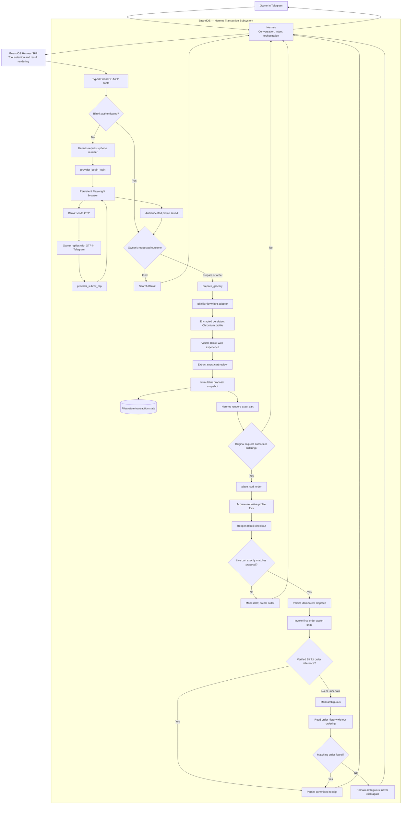

# Personal Hermes Blinkit Autonomy Design

**Date:** 2026-07-14
**Status:** Approved for implementation planning

## Objective

Make a single owner's Hermes deployment able to place real Blinkit COD orders from a Telegram conversation. ErrandOS runs inside the owner's VPC, retains the owner's authenticated Blinkit browser profile, prepares and verifies the cart, attempts the final order action once, and returns a verified receipt or an explicitly uncertain outcome.

The first release uses one ErrandOS process, filesystem transaction state, one persistent Chromium profile, and one active browser operation at a time. PostgreSQL workers and restart-safe distributed execution are a later hardening phase after the personal flow completes a supervised low-value canary.

## Product experience

The owner can say:

> Order four packets of Lays from Blinkit using COD and deliver them to home.

Hermes interprets the request through the ErrandOS skill. If the saved Blinkit session is active, Hermes prepares and places the order without another approval prompt. If authentication is required, Hermes asks for the phone number, triggers the Blinkit OTP, asks for the OTP in the same private Telegram conversation, submits it through ErrandOS, and resumes the original order.

Requests stop at the outcome expressed by the owner:

- “Find Lays” performs discovery only.
- “Prepare four packets and show the total” stops after cart preparation.
- “Order,” “buy,” or “place the order” authorizes autonomous COD dispatch for the exact requested cart.

Hermes renders the exact provider, products, variants when available, quantities, fees, total, address summary, ETA, payment mode, status, and verified order reference when committed.

## System boundary

Hermes is the owner's intelligence layer. It owns conversation, intent classification, missing-information questions, typed tool selection, and result presentation.

ErrandOS is Hermes's transaction subsystem. It owns the browser profile, provider session, cart manipulation, exact proposal snapshot, autonomous authorization, idempotency, final provider action, receipt, and reconciliation.

Playwright is an internal execution driver. Hermes never receives selectors, cookies, browser objects, profile paths, raw HTML, or arbitrary browser primitives.



## First-release architecture

### Runtime

Run a single control-plane process in the owner's VPC with:

- a persistent encrypted volume for Chromium profiles and transaction files;
- one configured principal and Blinkit account key;
- one exclusive filesystem profile lock;
- headed Chromium for supervised development and optional headless Chromium after the live flow is verified;
- explicit environment switches for browser actions and live commit as operator kill switches.

Do not add multi-user authentication, distributed leases, worker sharding, or multi-region profile replication to this release.

### Provider adapter

Replace the generic, oversized transaction connector with focused Blinkit modules for profile access, login, authentication detection, product matching, cart extraction, preparation, live revalidation, commit, and reconciliation. Keep provider behavior behind typed application ports.

Use semantic accessible locators and provider-scoped containers. Product selection, payment selection, and the final order action must resolve uniquely. Agentic reasoning may recover harmless navigation or explain drift, but financial facts and final-action eligibility come from deterministic extraction and comparison.

### Authentication

The first release permits the owner to send the phone number and OTP in a private Telegram conversation. Hermes passes those values through the typed login tools to the waiting Playwright page.

The OTP may travel through Telegram, Hermes, and MCP. ErrandOS must not echo it in tool output, persist it in transaction state, or include it in application logs, screenshots, or traces. The in-process login session has a bounded expiry and releases its browser context and profile lock on completion, timeout, or error. A process restart during login requires a fresh OTP; an authenticated persistent profile survives restarts.

`provider_auth_status` must inspect provider-specific visible state in the saved profile and return a truthful redacted lifecycle state.

### Cart preparation

Preparation verifies the active Blinkit account and selected delivery location, identifies exact product cards and variants, applies requested quantities, reaches the checkout review without ordering, and extracts:

- stable product identity when visible;
- provider title and variant;
- quantity, unit price, and line total;
- fees, discounts, and grand total;
- delivery address summary and provider location reference when available;
- delivery ETA;
- COD availability and selected payment mode;
- preparation time, expiry, and provider fingerprint.

If any required material field is missing or internally inconsistent, preparation fails without creating an orderable proposal.

### Autonomous COD

The single-owner mode removes the external approval service, per-order confirmation, and mandatory spending limit. A clear ordering intent authorizes Hermes to call `place_cod_order` for the prepared Blinkit COD proposal.

The control plane self-authorizes the exact proposal hash internally. Autonomous authority does not remove transaction correctness:

- repeated calls with the same idempotency key return the same outcome;
- the stored proposal is immutable authority;
- the live checkout is re-extracted immediately before dispatch;
- every material live term must match the stored proposal;
- the final control must resolve uniquely;
- the final provider action is invoked at most once;
- success requires a verified Blinkit order reference.

The first release supports Blinkit grocery with COD only. Card, UPI, wallet, and bank-challenge flows are outside this slice.

### Failure and reconciliation

- Invalid OTP keeps the bounded challenge available for another attempt when Blinkit permits it.
- Missing or expired authentication restarts the phone/OTP flow.
- Uncertain product matching returns candidates or fails instead of selecting an unrelated product.
- Unavailable variants and COD return exact unavailable states.
- Missing cart terms, location mismatch, or selector drift stop before dispatch.
- Any price, quantity, fee, total, address, ETA, or payment change makes the proposal stale and requires fresh preparation.
- A missing or non-unique final control stops without clicking.
- A failure before final invocation may retry through the same idempotency key.
- A timeout, navigation failure, or process uncertainty after final invocation becomes `ambiguous`.
- Reconciliation reads Blinkit order history and correlates the proposed order without placing, changing, cancelling, or retrying an order.
- Hermes never reports success without a committed receipt containing a verified provider reference.

## Hermes skill

Update the existing `hermes/skills/errandos` skill rather than creating a competing skill. Keep the primary `SKILL.md` concise and put the architecture diagram and detailed state map in a directly linked reference.

The skill teaches Hermes to:

1. classify find, prepare, and order intent;
2. check authentication before authenticated work;
3. ask for phone and OTP in Telegram when required;
4. resume the original grocery request after login;
5. prepare and render exact cart terms;
6. autonomously call `place_cod_order` only for explicit ordering intent;
7. render committed, stale, unavailable, and ambiguous states truthfully;
8. call read-only reconciliation for ambiguous results without another order attempt.

Skill changes follow documentation TDD. Run baseline scenarios against the current skill, record its failures, update the minimum necessary guidance, validate the skill structure, and forward-test the same scenarios against the revised skill.

## Verification

### Automated tests

Use test-first development for every behavior change. Cover:

- login session ownership, timeout, cleanup, invalid OTP, and output redaction;
- real auth-state detection through sanitized fixtures;
- exact product matching and refusal of unrelated products;
- complete cart extraction and rejection of missing material fields;
- hash changes for every material cart change;
- live checkout comparison and stale rejection;
- idempotent duplicate `place_cod_order` calls;
- exactly one final-action invocation;
- ambiguous outcome handling and read-only reconciliation;
- no OTP, cookie, selector, raw HTML, browser path, or provider state in returned MCP data;
- Hermes skill behavior for discovery, preparation, autonomous ordering, login recovery, and ambiguous reconciliation.

Run the narrow package test after each change, then run:

```bash
pnpm typecheck
pnpm lint
pnpm test
pnpm build
git diff --check
```

PostgreSQL integration tests require an available test database. Do not claim PostgreSQL durability from a run in which those tests cannot connect.

### Live verification ladder

Automated tests never place real orders. Live verification is supervised and progresses in this order:

1. Open Blinkit and verify delivery geolocation.
2. Trigger one real OTP, submit it through Hermes, and verify the persisted authenticated profile.
3. Perform read-only authentication status and product discovery.
4. Prepare a real cart with live commit disabled and prove no order was placed.
5. Compare the extracted proposal with the visible Blinkit checkout.
6. Enable live commit and place one explicitly initiated, low-value COD canary needed by the owner.
7. Verify the provider order reference and receipt rendering.
8. Exercise read-only status and reconciliation against the canary.

Any discrepancy pauses live progression and returns to fixtures or prepare-only verification.

## Deployment configuration

The personal VPC deployment uses filesystem persistence and a persistent encrypted volume. The intended live configuration includes:

```text
ERRANDOS_PERSISTENCE_MODE=filesystem
ERRANDOS_LIVE_BROWSER_ACTIONS=true
ERRANDOS_LIVE_COMMIT=true
ERRANDOS_TRUSTED_AUTONOMOUS_COD=true
ERRANDOS_BROWSER_HEADLESS=true
```

The deployment also supplies the data root, profile-reference secret, local authorization secret, owner principal, Blinkit account key, and delivery coordinates. Secrets and browser state remain outside source control.

## Deferred hardening

After the filesystem release completes the canary, move the proven provider adapter into the existing PostgreSQL authorization, outbox, worker, receipt, and reconciliation model. That phase adds restart-safe login challenges, durable dispatch workers, abandoned-dispatch recovery, renewable profile leases, readiness, monitoring, backup, restore, and operational runbooks without changing the Hermes-facing user experience.

## Acceptance criteria

- A private Telegram request can drive phone/OTP login and persist the owner's Blinkit session.
- A discovery request never mutates a cart or orders.
- A preparation request creates a real cart and stops before ordering.
- An explicit order request can autonomously place a Blinkit COD order without external approval or a spending cap.
- Every material checkout term is extracted and revalidated before dispatch.
- Duplicate requests cannot cause a second final-action invocation.
- A committed response contains a verified Blinkit order reference.
- An uncertain response remains ambiguous and uses read-only reconciliation.
- The existing Hermes skill correctly orchestrates and renders the complete workflow.
- Automated repository gates pass, and the live ladder completes through one supervised low-value COD canary.
