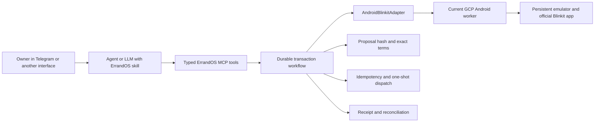
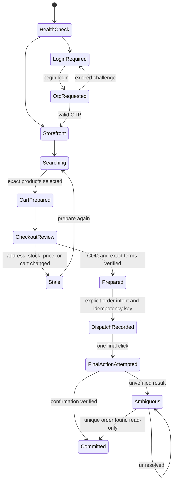

# Blinkit Android Agent Workflow and Skill Design

**Date:** 2026-07-18  
**Status:** Approved for implementation

## Objective

Provide a reusable ErrandOS workflow and Agent Skills-compatible skill that lets Hermes or another tool-capable LLM operate Blinkit COD through the current persistent Android emulator on the GCP worker.

The agent decides what semantic operation is needed. ErrandOS owns transaction state and exposes narrow typed tools. A provider-specific `AndroidBlinkitAdapter` owns Appium and UiAutomator2 screen interaction. Agents never receive raw device controls.

The first release supports one owner, one Blinkit account, one saved Home location, one GCP Android worker, and COD only. Zepto, Instamart, browser execution, online payments, additional accounts, and parallel emulators are out of scope.

The current repository guidance still describes Playwright as the mandatory provider path. Implementation must update that guidance in the same change that activates `AndroidBlinkitAdapter`: Blinkit becomes Android-only, and no live Blinkit runtime may instantiate the old browser adapter. Until that migration is merged and tested, the Android path remains a canary rather than a production MCP implementation.

## Architecture



### Responsibility boundary

The agent owns:

- interpreting search, preparation, and ordering intent;
- asking for missing product variants, the private phone number, or OTP;
- choosing a typed ErrandOS tool;
- rendering structured results;
- following up on stale or ambiguous outcomes.

ErrandOS owns:

- the owner and account binding;
- authentication lifecycle and sensitive-value redaction;
- exact checkout snapshots and proposal hashes;
- idempotency and dispatch state;
- material-term revalidation;
- at-most-once final action;
- committed receipts and read-only reconciliation.

`AndroidBlinkitAdapter` owns:

- Blinkit screen detection;
- semantic Appium operations;
- provider-specific selectors and scrolling;
- overlay handling;
- sanitized checkout and confirmation extraction.

Appium, ADB, selectors, coordinates, screenshots, UI XML, arbitrary device commands, and Appium session identifiers are not exposed through MCP or placed in the skill.

## Agent skill

The existing `hermes/skills/errandos` package remains the single user-facing ErrandOS skill. Its Blinkit path is updated from Playwright assumptions to the Android worker and gains two references:

```text
hermes/skills/errandos/
├── SKILL.md
└── references/
    ├── architecture.md
    ├── blinkit-android-workflow.md
    └── rendering-examples.md
```

The skill maps intent to operations:

- search wording calls `blinkit_search`;
- add, prepare, cart, or total wording calls `blinkit_prepare_cod_order`;
- order, buy, or place wording prepares and renders exact terms before `blinkit_place_cod_order`;
- an OTP challenge asks for the OTP in the private owner conversation and immediately submits it;
- an uncertain final outcome calls `blinkit_reconcile_order` and never calls the commit tool again.

The skill does not teach agents how to use Appium. It teaches when to call semantic ErrandOS operations and how to present their results. The same `SKILL.md` can be loaded by Hermes or another Agent Skills-compatible runtime. Runtimes without skill loading may inject the same content as trusted system context.

## Typed tool contract

The Android Blinkit workflow exposes these semantic operations:

- `blinkit_auth_status`
- `blinkit_begin_login`
- `blinkit_submit_otp`
- `blinkit_search`
- `blinkit_prepare_cod_order`
- `blinkit_place_cod_order`
- `blinkit_order_status`
- `blinkit_reconcile_order`

Existing generic ErrandOS tool names may remain as compatibility aliases only when their schemas and behavior are identical. There is no raw Appium or device-control tool.

### Authentication

`blinkit_begin_login` accepts the private owner's phone number as an ephemeral typed input. `blinkit_submit_otp` accepts the active challenge OTP as an ephemeral typed input. Neither value may appear in responses, durable state, screenshots, traces, or logs.

Authentication returns sanitized states: `active`, `login_required`, `otp_requested`, `challenge_expired`, or `error`. A still-active challenge is reused rather than starting another login.

### Preparation

`blinkit_prepare_cod_order` accepts the stable account key, exact requested products and quantities, and the saved Home reference. It returns an immutable proposal containing:

- proposal ID and canonical proposal hash;
- exact available line items, quantities, unit prices, and line totals;
- unavailable requested items;
- fees and discounts;
- total in INR;
- saved-address reference and safe label;
- COD payment mode;
- ETA when available;
- preparation and expiry times;
- provider fingerprint.

No substitution occurs without a new owner choice. Preparation stops if COD is unavailable.

### Commit

`blinkit_place_cod_order` requires the proposal ID and a deterministic idempotency key derived from the originating interface event plus the proposal ID. The same proposal always reuses the same key.

Before dispatch, ErrandOS re-extracts and compares all material terms: item identity, quantity, prices, fees, total, address, ETA, payment mode, and provider fingerprint. A difference returns `stale` without a final click.

ErrandOS writes durable dispatch state before invoking the adapter's final action. The adapter must find exactly one semantic `Place Order` control and attempt it once. A duplicate key returns the existing operation rather than attempting another click.

Commit returns one of:

- `committed` with a verified receipt and provider reference when available;
- `stale` when terms changed before dispatch;
- `committing` while a previously recorded dispatch is running;
- `ambiguous` when the final click may have occurred but confirmation is unverified;
- `failed` only when ErrandOS knows the final action was not attempted.

### Reconciliation

Reconciliation is read-only. It inspects Blinkit order history and requires one unique order matching the proposal's time window, exact lines, total, address reference, and payment mode. It may convert `ambiguous` to `committed`; it never invokes `Place Order`.

## Android state machine



The adapter provides focused operations:

- `detectStage`
- `ensureAuthenticated`
- `selectSavedAddress`
- `searchExactProduct`
- `setCartQuantity`
- `openCheckout`
- `extractUnavailableLines`
- `selectCashOnDelivery`
- `extractCheckoutTerms`
- `clickPlaceOrderOnce`
- `extractConfirmation`
- `reconcileFromOrderHistory`

Every operation uses semantic screen evidence. Off-screen controls are scrolled into view before interaction. Exact selectable controls are distinguished from headings; for example, `Cash on Delivery` must not match the `Pay On Delivery` section heading.

Known overlays such as location permission, saved-address selection, promotional content, and Google Play review prompts have explicit detectors and bounded dismiss actions. Unknown overlays stop the operation with a sanitized stage rather than triggering speculative clicks.

An address or store change invalidates the visible cart. The adapter reloads the saved Home location and re-extracts the cart before preparation continues. Out-of-stock lines are returned separately and excluded from the payable proposal.

## GCP worker protocol

The current GCP worker processes one mutating job at a time. The control plane dispatches authenticated semantic jobs such as `auth_status`, `begin_login`, `submit_otp`, `search`, `prepare_checkout`, `commit_once`, and `reconcile`.

Worker responses contain typed sanitized facts only. The worker initiates or accepts only the existing restricted management path. Appium and ADB remain bound locally and are not public.

Safe reads and incomplete preparation may be retried. A recorded commit dispatch may not be retried. If the worker or Appium disconnects after dispatch, the operation becomes `ambiguous` until reconciliation proves one unique result.

## Rendering contract

Search results show provider, exact product title, pack size, price, availability, and ETA when present.

Prepared proposals show every available line and unavailable request, quantities, prices, fees, discounts, total, Home label, COD, ETA, expiry, and the prominent statement that nothing has been ordered.

Committed results show the verified status, exact total, COD, ETA, receipt ID, and provider reference when available. Ambiguous results state that the outcome is unknown and reconciliation is required. Raw JSON and sensitive provider state are never shown.

## Failure handling

- Missing authentication enters the typed login flow.
- Expired OTP challenges require a new challenge; OTP submission is never guessed or replayed.
- Ambiguous products stop and request a more exact variant.
- Missing products are returned as unavailable; no silent substitution occurs.
- COD unavailability stops preparation and never falls back to a saved card.
- Changed checkout terms return `stale` before dispatch.
- Emulator or Appium failure before dispatch is safe to retry.
- Any unverified result after dispatch is `ambiguous` and cannot re-enter commit.
- Reconciliation requires a unique matching order; zero or multiple matches remain ambiguous.

## Testing and acceptance

Offline tests use sanitized accessibility fixtures and fake Appium ports. They cover:

- screen-stage detection;
- location, saved-address, promotion, and review-overlay handling;
- exact selectable-row matching and scrolling;
- `Pay On Delivery` versus `Cash on Delivery` disambiguation;
- stale carts after address or store changes;
- unavailable-line extraction;
- exact checkout arithmetic;
- proposal canonicalization and hashing;
- deterministic idempotency and duplicate handling;
- exactly one final action;
- Appium disconnect immediately after the click;
- read-only reconciliation;
- phone, OTP, address, screenshot, UI-dump, and session-data redaction.

The controlled live canary on the current GCP emulator verifies:

1. Existing Blinkit authentication remains active.
2. Search and cart preparation work through typed operations.
3. The saved Home location is selected.
4. COD is found, scrolled into view, and selected exactly.
5. Exact checkout terms are extracted and reconciled mathematically.
6. Commit remains disabled during preparation tests.
7. One explicitly authorized low-value COD order exercises durable dispatch, one final action, provider confirmation, and receipt creation.

The release is accepted only when an agent can complete the workflow using typed tools without direct Appium, ADB, coordinate, screenshot, UI XML, or browser control, and no successful order is claimed without verified provider evidence.

## Explicit non-goals

- Zepto, Instamart, or other grocery providers.
- Card, UPI, wallet, or bank-challenge automation.
- Browser or Playwright execution for Blinkit.
- Multiple owners, accounts, emulators, or parallel mutations.
- A custom Android client application.
- Public Appium, ADB, VNC, or emulator endpoints.
- Generic device-control MCP tools.
- Device-integrity bypasses or private API reverse engineering.
