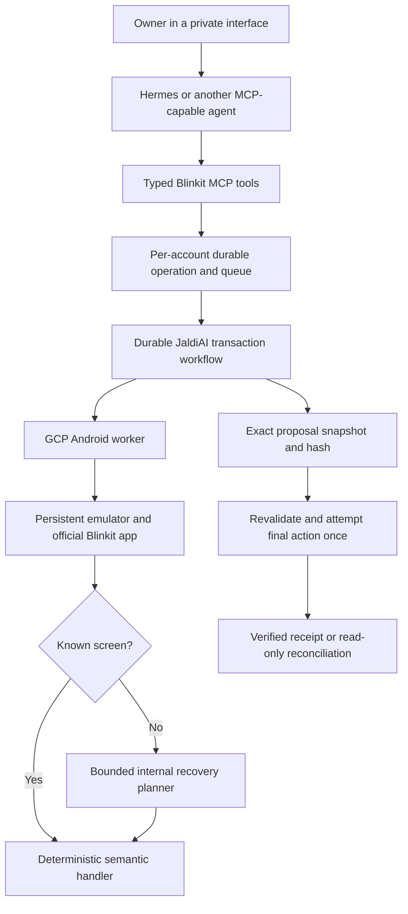

# JaldiAI Blinkit architecture

Long Android preparation returns an `operationId` immediately. JaldiAI persists running, completed, blocked, failed, or expired state, serializes work for the account/emulator, and lets Hermes poll without holding one MCP call open. A Hermes restart does not erase the operation record.

Hermes owns intent, clarification, tool choice, and presentation. JaldiAI owns account state, the Android session, product and cart facts, recovery, proposal snapshots, hashes, idempotency, final provider actions, receipts, and reconciliation.

## Proposal hash

JaldiAI hashes a canonical snapshot of material order terms: selected products, quantities, prices, fees, discounts, total, saved address, payment mode, ETA when present, and provider fingerprint. Immediately before `Place Order`, it extracts the live checkout again and compares the terms. A mismatch returns `stale` without a final click.

In personal owner-autonomous mode, explicit ordering language authorizes the prepared Blinkit COD proposal. A separate approval screen is not required, but authorization remains bound to the exact proposal hash.

## Screen recovery

Normal screens and known overlays use deterministic handlers. An unfamiliar pre-dispatch screen may be summarized into redacted semantic elements with opaque handles for a bounded recovery planner. JaldiAI validates each action, observes the result again, and stops after a small action limit.

Raw screen XML, coordinates, selectors, phone numbers, OTPs, and device controls never enter MCP results. Exploratory recovery is disabled after final dispatch.

## At-most-once final action

JaldiAI records dispatch before invoking exactly one semantic final action. A timeout or disconnect afterward becomes `ambiguous`; it never triggers another click. Reconciliation reads order history and marks the proposal committed only when one unique order matches the prepared time window and exact terms.

## Kill switches

- `ERRANDOS_LIVE_BROWSER_ACTIONS=false` disables live provider mutations, including Android preparation.
- `ERRANDOS_LIVE_COMMIT=false` disables final order actions.
- `ERRANDOS_TRUSTED_AUTONOMOUS_COD=false` disables personal autonomous COD placement.
