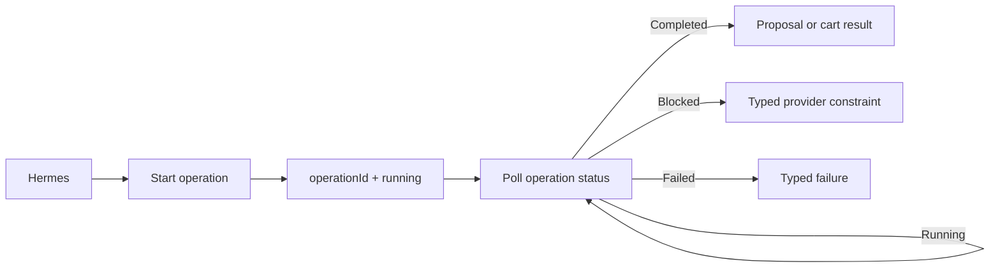

# Blinkit implementation roadmap

This is the canonical owner-approved Step 1–8 sequence for the Blinkit Android workflow. Agents must use these exact step names and definitions when reporting status or choosing the next task. Older implementation plans may provide technical context, but they do not override this sequence.

## Status tracker

Last audited: 2026-07-25

| Step | Status | Current evidence / remaining work |
| --- | --- | --- |
| 1 — Readiness and useful errors | Live verified | `blinkit_readiness` and sanitized dependency states are exposed. Ordinary provider/UI failures return typed tool results rather than MCP-connectivity errors. |
| 2 — Cart editing tools | Implemented and real-cart tested | Exact opaque line IDs, quantity changes, removal, clearing, verified full-cart returns, and refreshed fingerprints are implemented. |
| 3 — Checkout constraints | Live verified | Every listed provider constraint has a typed `blocked` contract. Through Hermes and the real Android worker, one ₹25 item returned exact ₹25/₹50 COD-minimum facts, while three ₹25 items returned an immutable COD proposal. |
| 4 — Asynchronous Android operations | Live verified | Canonical start/status tools, owner-isolated durable records, per-account serialization, worker leases, and hard deadlines are implemented. Hermes completed a real 48-second preparation and recovered the same terminal proposal after a gateway restart. |
| 5 — Addresses and order history | Live verified | `blinkit_list_saved_addresses` returns real labels with opaque references, and `blinkit_recent_orders` returns sanitized real order summaries through the normal Hermes MCP path. Unknown item quantities are omitted rather than invented. |
| 6 — Simplify the MCP surface | Live verified | Production advertises 24 canonical Blinkit tools while retaining legacy handlers behind an explicit compatibility option. VPC, Hermes chat, and an owner-originated Telegram request all worked through the focused surface. |
| 7 — Update the Hermes skill | Live verified | The canonical-only skill is installed on Hermes, handles structured constraints and async terminal states, and successfully drove real readiness and final-canary turns without raw device fallbacks. |
| 8 — Deployment and live verification | Live verified | The complete non-commit final canary passed through Hermes and the real Android worker, and the owner subsequently confirmed the deployed Telegram path works. |

Status words are evidence-based:

- **Not started:** no canonical contract/runtime exists.
- **In progress:** only part of the definition of done is proven.
- **Implemented:** code and focused tests pass.
- **Live verified:** the normal Hermes MCP path has been checked against the real Android worker without an unauthorized final action.

## Step 1 — Readiness and useful errors

Add:

- `blinkit_readiness`
- dependency checks for VPC → SSH → GCP worker → emulator → Appium → Blinkit app → authentication
- typed errors such as:
  - `worker_unreachable`
  - `emulator_unavailable`
  - `login_required`
  - `screen_blocked`
  - `cod_minimum_not_met`
  - `provider_timeout`

Definition of done:

- Hermes no longer reports “MCP unreachable” for ordinary Blinkit UI failures.
- Hermes can tell the user exactly which component is unavailable.
- Existing search, cart, and proposal flows still work.

Estimated effort: 0.5–1 day.

## Step 2 — Cart editing tools

Add:

- a stable opaque `cartLineId` in `blinkit_cart_status`
- `blinkit_set_cart_item_quantity`
  - quantity 1–20 updates the line
  - quantity 0 removes the line
- `blinkit_clear_cart`

Definition of done:

- Hermes can inspect, remove, increase, or decrease one exact item.
- Every mutation returns the complete verified cart and a new fingerprint.
- Cart editing never opens or commits the final order action.

Estimated effort: 1 day.

## Step 3 — Checkout constraints

Improve proposal preparation to return structured blocked states:

```json
{
  "status": "blocked",
  "reason": "cod_minimum_not_met",
  "itemSubtotal": 25,
  "requiredSubtotal": 50
}
```

Other reasons:

- `product_unavailable`
- `quantity_unavailable`
- `address_unserviceable`
- `cod_unavailable`
- `price_changed`
- `checkout_terms_unreadable`

Definition of done:

- One ₹25 item produces a useful COD-minimum response.
- Three ₹25 items produce an immutable COD proposal.
- Provider restrictions are never reported as MCP-connectivity failures.

Live verification evidence (2026-07-23):

- Hermes searched the real Blinkit Android catalog and selected the exact available ₹25 Lay's Magic Masala 58 g offer.
- A durable asynchronous preparation for one unit completed as `blocked` with `reason: cod_minimum_not_met`, `itemSubtotal: 25`, and `requiredSubtotal: 50`.
- A second preparation for three units completed with an immutable proposal containing exact item terms, fees, ₹233 total, Home, COD, expiry, proposal ID, and proposal hash.
- Both cases ran through Hermes → canonical MCP tools → SSH/Tailscale → GCP Android worker → Appium → official Blinkit app.
- The blocked provider restriction remained a structured terminal result and was not misreported as MCP unreachability.
- No final order or commit tool was invoked.

Estimated effort: 0.5–1 day.

## Step 4 — Asynchronous Android operations

Add:

- `blinkit_start_prepare_cod_order`
- `blinkit_operation_status`
- durable operation records
- `running`, `completed`, `blocked`, `failed`, and `expired` states

Flow:



Definition of done:

- A 30–90 second emulator action does not hold one MCP call open.
- Hermes can provide progress without tripping its circuit breaker.
- Restarting Hermes does not lose operation status.

Live verification evidence (2026-07-23):

- Hermes called `blinkit_start_prepare_cod_order`, received an operation ID immediately, and polled `blinkit_operation_status` instead of holding one MCP call open for the Android work.
- The real Android preparation completed in 48 seconds with an immutable COD proposal for the exact observed cart terms.
- Restarting `hermes-gateway.service` did not lose the operation. Hermes retrieved the same `completed` operation and proposal ID afterward.
- A live duplicate accessibility-card failure was first returned as a typed terminal failure. Exact duplicate offers are now collapsed before selection, while materially different candidates remain ambiguous; the provider suite covers this behavior.
- The operation is serialized by principal/account, guarded by a worker lease and hard deadline, and stored durably outside the Hermes process.
- No final order tool or provider final action was invoked during the canary.

Estimated effort: 2–3 days. This is the largest reliability improvement.

## Step 5 — Addresses and order history

Add:

- `blinkit_list_saved_addresses`
- `blinkit_recent_orders`

Return only safe structured information:

- address label and opaque reference
- order reference
- items
- total
- timestamp
- provider status

Definition of done:

- Hermes can ask “Which address?” using real saved labels.
- Hermes can verify whether an order exists before attempting reconciliation.
- No raw address, screenshots, or emulator state is exposed.

Live verification evidence (2026-07-23):

- The saved-address tool returned only real saved labels and opaque `addressReference` values through Hermes.
- The recent-orders tool returned three real delivered-order summaries through Hermes → MCP → SSH/Tailscale → GCP worker → Appium → Blinkit.
- The current Blinkit order-history list does not expose per-item quantities or a provider order ID. ErrandOS therefore omits unknown quantities and derives a stable opaque `orderReference` from the exact observed timestamp, total, and item names.
- Raw delivery addresses present on the provider screen were excluded by the parser and the strict MCP output contract.
- No cart mutation, checkout preparation, final order action, or reconciliation action was performed during verification.
- On 2026-07-26, the saved-address reader was hardened to scan up to 12 bounded address-book snapshots, deduplicate opaque references, stop on repeated content, and preserve label-only output. Focused tests cover discovering and selecting an off-screen `Work` entry while excluding its full address.
- Initial live Hermes attempts returned only `Home` and `Rajneesh Yadav`; three bounded experimental fallbacks returned typed `provider_timeout` failures and were rolled back to the checksum-verified `970c808-address-scroll-on-rapido-unavailable-019f9b07` release.
- After the owner closed and restarted Blinkit to clear the stale provider UI operation, the normal Hermes path returned both `Work` and `Home`, selected `Home` using its exact opaque reference, and verified the resulting cart as empty. No cart item, checkout, payment, or order action was performed. This confirms saved-address enumeration and selection work on the stable release when the provider app is not stale.

Estimated effort: 1 day.

## Step 6 — Simplify the MCP surface

Stop advertising irrelevant or duplicate tools to Hermes:

- generic Blinkit duplicates
- generic provider tools where a typed Blinkit equivalent exists

Keep the underlying compatibility layer temporarily so existing code does not break.

Definition of done:

- Hermes sees approximately 15 focused tools instead of 21 overlapping tools.
- Existing Telegram prompts continue working.
- The Blinkit skill uses only canonical tool names.

Implementation evidence (2026-07-23):

- Production MCP advertising is limited to focused Blinkit tools; generic transaction aliases and the synchronous new-cart duplicate remain available only when `ERRANDOS_MCP_LEGACY_TOOLS=true`.
- Focused MCP tests verify both the canonical production surface and compatibility mode.
- The deployed VPC server reports 24 tools with `hermes mcp test errandos`, including shared-cart import, and a production-like `hermes chat` session loaded and called the canonical status/search/start/poll/share tools.
- The persistent Telegram gateway is active with the same MCP configuration.
- On 2026-07-24, the owner confirmed a fresh Telegram request worked through the deployed Hermes path, completing the channel regression check.

Estimated effort: 0.5 day.

## Step 7 — Update the Hermes skill

Update the skill decision tree:

```text
Check readiness
    ↓
Check authentication
    ↓
Search or inspect cart
    ↓
Edit/build cart
    ↓
Prepare immutable proposal
    ↓
Render exact terms
    ↓
Place only on explicit ordering intent
    ↓
Return receipt or reconcile ambiguity
```

Include instructions for:

- location prompts
- review popups
- multi-option products
- COD minimums
- expired proposals
- price/hash changes
- ambiguous final actions
- never retrying the final action

Implementation evidence (2026-07-23):

- The skill maps every Step 3 `blocked` reason to bounded semantic recovery and never calls a provider restriction an MCP outage.
- It polls asynchronous operations through `completed`, `blocked`, `failed`, or `expired`, keeps short-lived sessions alive through terminal polling, and preserves the operation ID across gateway restarts.
- It covers location/review overlays, exact product choices, COD minimums, proposal expiry, price/hash changes, typed screen failures, ambiguous final actions, and at-most-once placement.
- Focused tests ensure the skill uses canonical asynchronous tools, contains all typed constraints, and preserves the raw-device and final-action boundaries.
- Revision `d8dd153` was installed into the live Hermes skill directory. A skill-preloaded Hermes turn called the real readiness tool and reported every dependency ready without a cart or order action.

Estimated effort: 0.5–1 day.

## Step 8 — Deployment and live verification

For every step:

1. Add failing tests.
2. Implement the smallest change.
3. Run package tests, typecheck, and lint.
4. Deploy to the GCP worker and Hermes VPC.
5. Run the normal Hermes MCP path.
6. Verify no final order action occurred.
7. Commit and push the working revision.

Final canary:

1. Inspect the cart.
2. Remove an item.
3. Change a quantity.
4. Prepare a COD-eligible proposal.
5. Render exact terms and hash.
6. Check proposal status.
7. Do not place an order unless the owner explicitly approves that fresh proposal.

Live verification evidence (2026-07-23):

- Hermes verified the real cart, then removed the exact Lay's line by opaque product ID. The returned cart preserved Amul Taaza Toned Milk at quantity four.
- Hermes changed that exact milk line from quantity four to three. The returned complete cart had ₹87 subtotal, Home, COD, eight-minute ETA, and a refreshed provider fingerprint.
- Hermes prepared the verified existing cart without placing it. The immutable proposal contained milk ×3 at ₹29, ₹62 provider charges, ₹149 total, Home, COD, eight-minute ETA, expiry, proposal ID, and proposal hash.
- A separate read-only `blinkit_order_status` call returned the same `prepared` proposal ID, hash, and exact terms.
- A final read-only cart inspection confirmed milk ×3 and the same post-edit fingerprint.
- `blinkit_place_cod_order`, generic commit tools, and every final provider action were excluded from the canary. Nothing was ordered.
- Local gates passed: skill validation, focused skill tests, typecheck, lint, full tests with PostgreSQL durability coverage, build, and `git diff --check`.

## Sequencing rule

The default sequence is Step 1, then Step 2, then Step 3, then Step 4, and so on. The owner may explicitly authorize work on a later independent step while another step is awaiting live verification. Such work does not change the status of the skipped step and must preserve all safety and deployment requirements in Step 8.

## Post-roadmap reliability hardening

Screen diagnosis and search normalization (live verified 2026-07-24):

- `blinkit_current_screen` reports only a strict semantic screen kind, whether search is available/recoverable/blocked, and optional safe product/cart facts.
- The worker and MCP contracts reject screenshots, UI XML, selectors, coordinates, resource IDs, emulator details, and arbitrary device state.
- Blinkit search now identifies a product-detail screen and uses its semantic Search or Navigate up control before continuing, instead of depending only on generic Android back behavior.
- The Hermes skill diagnoses one failed search/add with the sanitized screen tool, retries the original semantic operation at most once on a known recoverable screen, and stops on blocked/unknown state.
- From a real Blinkit product-detail screen, `blinkit_current_screen` returned the safe `product_detail` classification and exact safe catalog facts. A subsequent Diet Coke search recovered semantically and returned real search results without changing the cart.
- Owner screenshot delivery remains outside MCP and is implemented as an owner-only Telegram `/screen` command backed by a separate restricted SSH identity. It permits only catalog/search/product-detail surfaces and refuses login, OTP, address, checkout, payment, order-history, confirmation, and unknown screens.
- The production restricted capture returned a valid PNG from the real search-results screen, Hermes delivered it to the configured single-owner Telegram destination, and the gateway remained active with the owner-only command registration.
- Local focused suites, full PostgreSQL-backed tests, typecheck, lint, build, skill validation, and `git diff --check` pass.

Native cart sharing (live verified 2026-07-24):

- `blinkit_share_cart` uses Blinkit’s native Android cart-share flow and never prepares checkout or places an order.
- The adapter verifies a non-empty cart, opens the exact semantic Share control, handles Blinkit’s intermediate “Share your cart” confirmation, extracts only a `blinkit.com` or subdomain URL from the Android chooser, returns to the cart, and requires the cart fingerprint to remain unchanged.
- The MCP contract returns only `status`, the official `shareUrl`, and the verified cart fingerprint. It does not expose the chooser, Appium, ADB, screenshots, UI XML, selectors, coordinates, clipboard contents, or emulator state.
- The Hermes skill inspects the cart first, renders the official link exactly, treats it as owner-sensitive, and never interprets sharing as a proposal, approval, receipt, or ordering instruction.
- The real Hermes MCP path returned `completed` with a contract-valid Blinkit URL and fingerprint. A subsequent read-only screen check confirmed the emulator had returned to `checkout` with search still recoverable.
- The live run required no checkout preparation, payment selection, commit, or final provider action. Nothing was ordered.

Typed tool recovery and proposal preflight (live verified 2026-07-24):

- Every canonical `blinkit_*` MCP tool now returns an allowlisted structured failure envelope for ordinary runtime failures instead of turning a provider-screen problem into an MCP transport error. The envelope contains only `reason`, `retryable`, `suggestedAction`, and an optional sanitized worker stage.
- `blinkit_recent_operations` lists owner/account-isolated durable preparation operations so Hermes can recover an operation ID and terminal result after a process or conversation restart.
- `blinkit_select_saved_address` selects an exact saved address by its opaque reference and confirms only the selected safe label. It deliberately returns `cartStatus: unverified`; the Hermes skill immediately follows with the separately bounded `blinkit_cart_status` call before making any cart claim.
- `blinkit_compare_proposal` re-reads live cart/checkout terms and compares only allowlisted material fields against the immutable proposal. It never grants approval or attempts the final provider action.
- Search results may include an optional provider-supplied HTTPS image URL only when it belongs to an allowlisted Blinkit/Grofers host. The absence of an image remains a valid result; ErrandOS never substitutes a screenshot or guessed image.
- Contracts and focused tests cover strict failure redaction, owner/account isolation, restart recovery, address-reference selection, unchanged/changed proposal comparisons, and image-host filtering.
- The Hermes skill now treats structured `failed` results as reachable MCP responses, uses recent operations for recovery, requires an unchanged proposal comparison after owner confirmation and before placement, and renders optional trusted images without inventing them.
- Every Appium HTTP request has its own sanitized 30-second deadline, below the outer worker deadline, so a single stalled UI call cannot consume an unbounded operation.
- The real Hermes MCP path reported every readiness dependency ready, returned a valid empty recent-operation history, returned `proposal_not_found` as a typed non-retryable result for a deliberately unknown proposal, recovered product search from checkout, and listed saved addresses after semantic recovery from a product-detail screen.
- Exact Home selection completed through its opaque address reference and returned `cartStatus: unverified`, after which the required separate cart read returned the live two-line/four-unit cart, ₹365 subtotal, Home, an eight-minute ETA, and a fresh provider fingerprint.
- The live cart canary exposed redundant Appium element discovery on Home. The adapter now derives the exact semantic `View cart` target from one accessibility snapshot, keeps its geometry private, performs one bounded internal tap, and parses the verification snapshot without rediscovering the control. The production cart read completed in 23 seconds through Hermes's secure MCP entry.
- ErrandOS prepared that existing cart as a fresh immutable ₹377 COD proposal without placing it. A subsequent read-only `blinkit_compare_proposal` re-read live provider terms and returned `unchanged`, no material changes, and a current provider fingerprint while the proposal remained `prepared`.
- The GCP Android worker and Hermes VPC both ran revision `a1d6259` for the final canary. Local full PostgreSQL-backed tests, typecheck, lint, build, skill validation, and `git diff --check` passed.
- No commit tool, final order action, screenshot, raw UI state, or device command was used or exposed during this verification. Nothing was ordered.

Shared-cart import (implemented and deployed 2026-07-25; fresh-link canary pending):

- `blinkit_import_shared_cart` accepts only an HTTPS Blinkit-domain URL, dispatches it through Appium’s typed Android verified-link command, and returns the complete verified resulting cart only after reaching and verifying the official Blinkit app state.
- Android reports `blinkit.com` as a verified domain owned by `com.grofers.customerapp`. The adapter does not accept or interact with a generic browser page as a successful import.
- The result reports whether the resulting cart was `created`, `merged`, `updated`, or `unchanged`, plus the previous fingerprint when one existed. It deliberately does not echo the input link or expose Appium, ADB, intents, selectors, coordinates, screenshots, UI XML, emulator state, or provider-session data.
- A generic Blinkit page is not accepted as a successful import merely because the pre-existing cart can still be opened. The driver requires direct imported-cart evidence, a known semantic import confirmation, or a verified cart change.
- The import is a reversible cart mutation behind `ERRANDOS_LIVE_BROWSER_ACTIONS=true`. It never selects COD, creates a proposal, clicks the final action, or places an order.
- The canonical MCP surface contains 24 focused Blinkit tools after this addition. The Hermes skill treats a cart link as neither approval nor an order: it imports and renders the complete cart first, then uses the existing immutable-proposal, explicit-confirmation, proposal-comparison, idempotency, and at-most-once placement flow.
- Runtime revision `b1204be` is deployed to the GCP Android worker and included in the Hermes VPC checkout. `hermes mcp test errandos` connects successfully and advertises all 24 tools, including `blinkit_import_shared_cart`.
- A canary using a previously logged Blinkit short link reached Android dispatch but did not yield a recognized importable provider state; the tool returned the typed `screen_blocked` result and did not claim success. Final read-only verification found the same milk ×3 and ice-cream ×1 lines. Blinkit independently repriced the ice cream from ₹278 to ₹238, changing the live subtotal from ₹365 to ₹325 and refreshing the fingerprint; no shared-cart items were added or removed.
- Contract, Appium-client, Android-driver, adapter, worker, MCP, and skill tests pass. On the deployed revision, local PostgreSQL-backed full tests, typecheck, lint, build, skill validation, and `git diff --check` pass.
- Remaining live evidence: provide one fresh provider-generated shared-cart link, import it without preparing or placing an order, verify the complete returned cart and fingerprint, and confirm Hermes renders that result through the installed skill.
